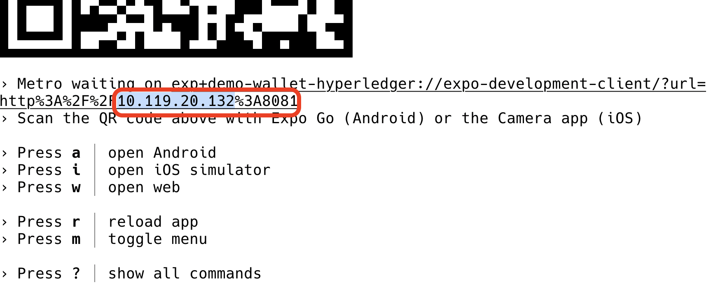

<h1 align="center">How To Build a Self-Sovereign Identity Agent With Hyperledger Aries Framework JavaScript</h1>
<h4 align="center">14 September 2022 | 09:00 - 12:30</h4>
<h5 align="center">Jakub Koci, Timo Glastra and Berend Sliedrecht</h5>
<p align="center">
<br>
<br>
<br>

<br>
<br>
<br>
</p>

Link to our discord: https://discord.gg/VkmcsFTH

Link to the Hyperledger Global Forum Channel: https://discord.com/channels/905194001349627914/1017366759168286753

## Table of content

- Prerequisites
- Context
- Section 1: Agent Initialization
- Section 2: Receiving An Invitation
- Section 3: Accepting A Credential
- Section 4: Sharing A Proof

## Prerequisites

- Node.js https://nodejs.org/en/download/
- Git https://git-scm.com

## Starting

To get started, clone the repository: 

```console
git clone https://github.com/blu3beri/hgf-demo-wallet.git
```

After cloning the repository we have to go into the folder and install yarn and our dependencies.

```console
cd hgf-demo-wallet
npm install --global yarn
yarn install
```

Now that everything is ready we can start our development server. This server will be used by the mobile application to get the code that we will be writing during this workshop.

To start the server run the following command:

```console
yarn start
```

This will output some code and in here we have to find our local IP address.

It will look something like this:




## Context

Everything that will be programmed within this workshop will be done in the
`src/workshop/` folder. Every file exports a function that needs your
implementation the of the specific feature to make the application work again.

## Section 1: Agent Initialization

> file: `agent-initialization.ts`

Before we even begin with creating a connection between two agents, we must
initialize our agent first. This will be done in the `agent-initialization.ts`
file.

The function here is called `initializeAgent` and it should return a class of
`Agent`. A very minimal agent does not need a lot, but there are some quirks
for specific environments, like React Native. In the configuration we can put
things like automatically accept all incoming credentials or the name of our
agent. The goal of this section is to configure it in a minimal way and check
what all our options are.

## Section 2: Receiving An Invitation

> files: `agent-initialization.ts`, `receiving-an-invitation.ts`

Now that our agent is setup, we can starting using it! The first thing we would
like to do is create a connection with another agent. This does require some
additional work in the agent configuration and some code where we use the
agent. The agent initialization will happen again in the
`agent-initialization.ts` file and the receiving of an invitation of another
agent will happen in the `receiving-an-invitation.ts` file.

The agent needs atleast the following attributes:

1. `autoAcceptConnection`
2. `mediation`
3. A configured wallet
4. In and outbound transport

Receiving the invitation happens in three steps:

1. Scanning a QR code with the invitaion url inside
2. Parsing the invitation url to a invitation object
3. Receiving the invitation on the agent

The application provides a scanner and for this section we only have to add a
parse invitation function and a receive invitation function.

## Section 3: Accepting A Credential

> files: `agent-initialization.ts`, `accepting-a-credential.ts`

Awesome! We have a connection with an issuing agent and now we need to be able
to receive credentials from them. Before we even begin with this, we must
update out agent configuration again to support this new use case. All the
data, like the schema and credential definition are registered on a ledger. So,
in order to receive credentials we must connect to the same ledger to be able
to retrieve this data. 

The agent needs the following attributes added:

1. `indyLedgers`
2. `autoAcceptCredential`

Now that the agent is connected to the correct ledger we are able to receive
credentials from the issuer. 

There are, within this demo, three things that we can do this a credential. We
can accept it and add it to our wallet, we could also decline it or even delete
the credential afterwards from our wallet. We must implement all these three
methods in the `accepting-a-credential.ts` file.

## Section 4: Sharing A Proof

> file: `sharing-a-proof.ts`

We have our first credential, and ofcourse now we want to share it. Sharing a
credential can get very complex, because of the restrictions. A verifier can
request that specific fields come from specific credentials and maybe a
predicate even saying that you must be older than 21. Luckily, AFJ provides
some utility methods to make it a lot easier.

In order to complete this section we must be able to respond to an incoming
proof with the correct credentials, which can be done with the following steps:

1. Get all the credentials that match the proof request
2. Select the first instance that matches the request
3. Respond to the proof request with only the required credentials
